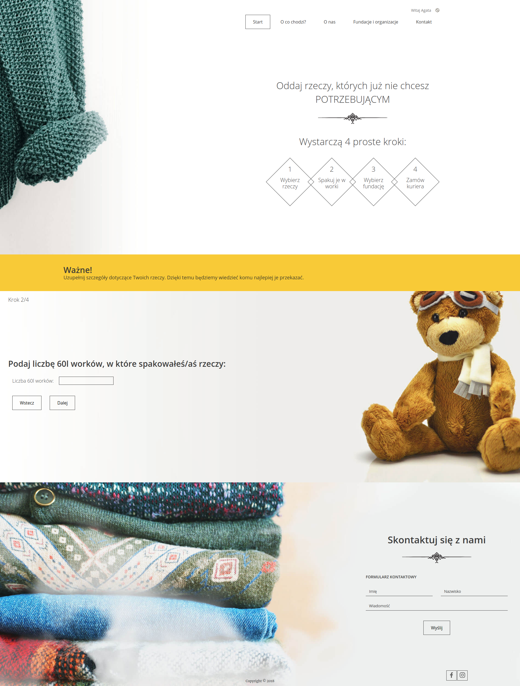
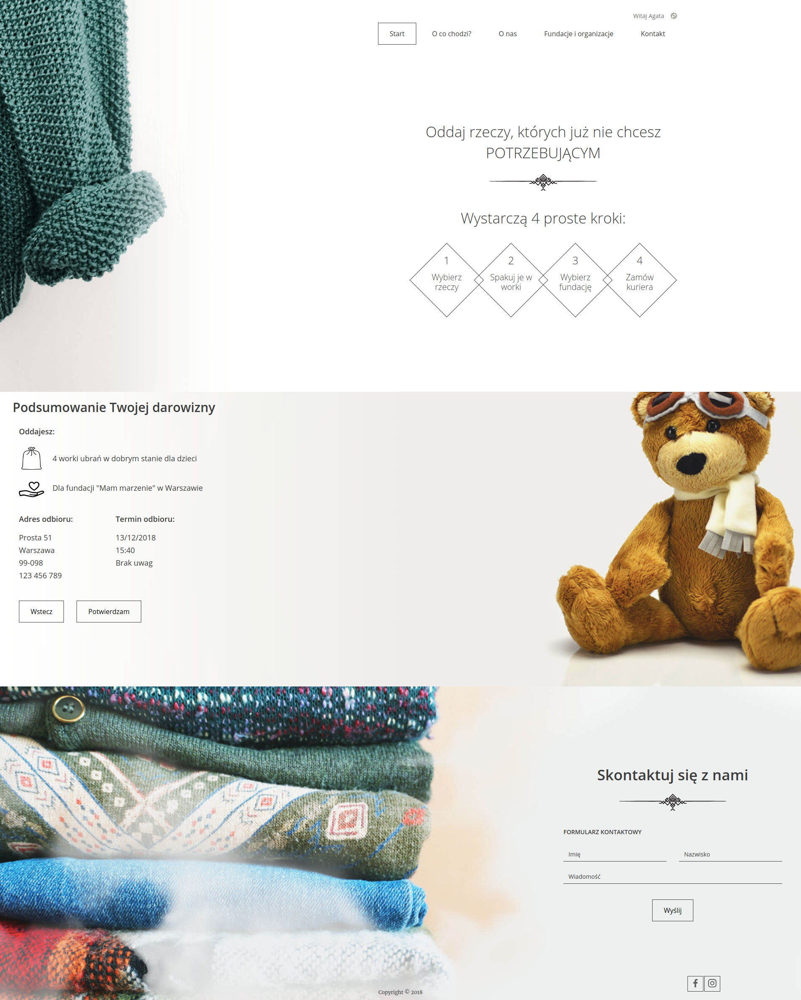
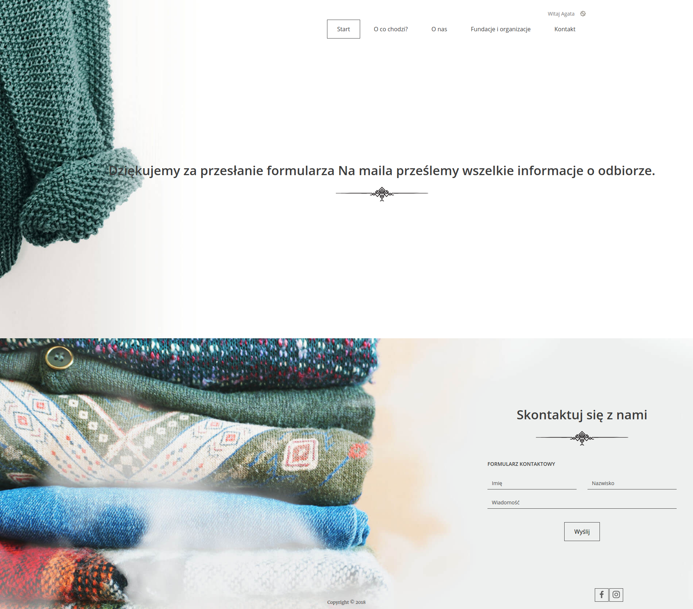

# Information about the project "I will give in good hands"

The aim of the project is to create a place where everyone will be able to give away unnecessary things to trusted institutions.

## Where did the idea for the project come from?

* The user has things at home that he does not use, but they are in good condition and he wants to give them to people who can use them - but he does not know how to do it easily.
* There are many solutions available, but many require extra effort or are not trustworthy.
  You have to go to verified places, and there is no time or no way to go there. On the other hand, containers under the house or local collections are unverified and it is not known whether these things will actually go to those in need.

## Technologies
* Spring Boot
* Hibernate
* JSTL and JSP in front
* mysql
* lombok
* Tomcat

## How to start?

1. Create a [*fork*](https://guides.github.com/activities/forking/) repository with tasks.
2. Clone the repository to your computer. Use the command for that `git clone repository_address`. 
3. You can find the address of the repository on the repository page after pressing the button "Clone or download". 
4. Note that to use your own fork address, it should look like this:
`https://github.com/your-login/repository_address`

3. Remember to create a database called "charity-donation". If your database authorization details are different,
   you also need to make the appropriate correction.

## User flow:
### 1 - Home page

On the homepage, the user can see:
- the number of donated bags;
- the number of donors

In addition, by clicking on Donate, you can go to the appropriate form.

### 2 - Step 1

In the first step, the user selects the category of gifts he wants to give.

### 3 - Step 2

In the second step, the user enters the number of bags in which he packed the gifts.

### 4 - Step 3

In the third step, the user selects the foundation to which he wants to donate.

### 5 - Step 4

In the fourth step, the user enters the address and the date of receipt of the item by the courier.

### 6 - Summary

After entering all the data, the user sees a summary to be confirmed.

### 7 - Response

After approval, the form submission information is displayed.

